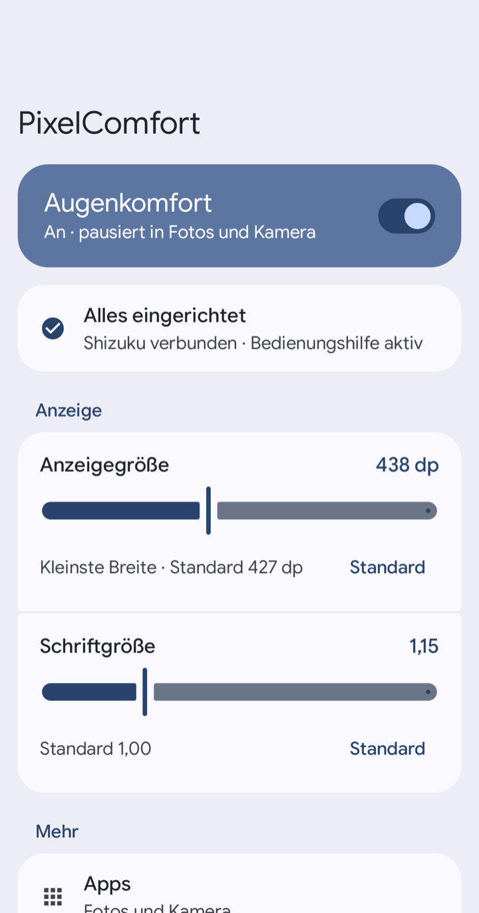
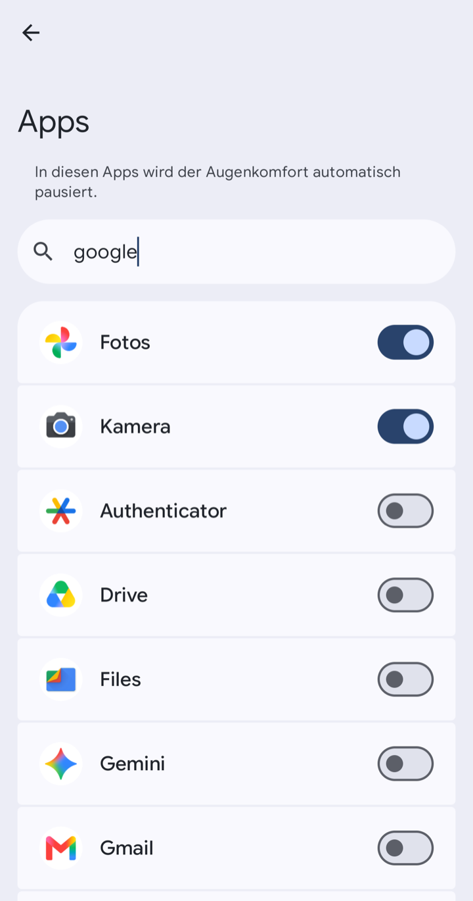
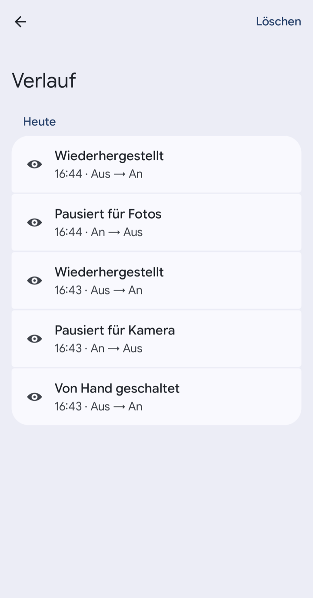

# 👁️ PixelComfort

[English](README.md) · **Deutsch**

**Schaltet den Augenkomfort-Modus (Comfort View) auf dem Google Pixel automatisch aus, sobald Kamera oder Google Fotos geöffnet werden – und stellt danach exakt den vorherigen Zustand wieder her.**

-3DDC84?logo=android&logoColor=white)


[](https://github.com/WEITERFUNKEN-Thomas/pixelcomfort/releases/latest)

---

## 🤔 Warum?

Der mit dem **Pixel Drop (März 2026)** eingeführte *Comfort-Filter* („Augenkomfort-Modus", Einstellungen → Display & Touch → Komfort-Filter) gibt dem Display eine wärmere, pastellige Optik – super für die Augen, aber **furchtbar beim Fotografieren**: Sucherbild und Fotos-Vorschau wirken farbstichig.

Google bietet dafür – anders als beim Nachtlicht – **keinen Zeitplan und keine öffentliche API**. PixelComfort löst das automatisch:

```
Kamera/Fotos öffnen  ──▶  Comfort View AUS
App verlassen        ──▶  vorheriger Zustand wiederhergestellt
```

Dabei wird **immer der echte System-Zustand respektiert**: Der aktuelle Wert wird live gelesen und gemerkt – war der Filter vorher aus, bleibt er aus. Andere Einstellungen (Dynamisch, Intensität) werden nicht angetastet.

## ✨ Funktionen

- **Automatik** – pausiert den Augenkomfort in den gewählten Apps und stellt ihn danach wieder her
- **App-Auswahl** – Apps aus einer Liste mit Symbolen und Suche wählen
- **Hauptschalter und Schnelleinstellungs-Kachel** – Augenkomfort von Hand schalten
- **Anzeige** – Regler für Anzeigegröße (kleinste Breite in dp) und Schriftgröße, je mit *Standard*-Button
- **Privates DNS je nach WLAN** – im Heim-WLAN aus (damit z. B. AdGuard Home filtert), überall sonst an
- **Verlauf** – zeigt, wann pausiert, wiederhergestellt oder von Hand geschaltet wurde und was schiefging
- **Shizuku-Warnung** – eine Benachrichtigung meldet, wenn Shizuku nicht läuft
- **Material You** – folgt den Systemfarben, hell und dunkel
- **Deutsch und Englisch** – folgt der Systemsprache, ab Android 13 pro App wählbar

## 📱 Screenshots

| Start | Apps | Verlauf |
|:---:|:---:|:---:|
|  |  |  |

## ⚙️ Wie es funktioniert

Der Schalter liegt als nicht-öffentlicher Key in den System-Settings – **per adb-Diff auf einem Pixel 10 Pro ermittelt**, nicht geraten:

| Einstellung | Namespace | Key | Werte |
|---|---|---|---|
| Augenkomfort-Modus | `system` | `cv_enabled` | `1` = an, `0` = aus |
| Dynamisch (Adaptiv) | `system` | `cv_dynamic_enabled` | wird **nicht** angefasst |
| Intensität | `system` | `cv_preferred_intensity` | wird **nicht** angefasst |

Drei Bausteine:

1. **AccessibilityService** – lauscht auf `TYPE_WINDOW_STATE_CHANGED` und erkennt, wann eine der gewählten Apps in den Vordergrund kommt oder verschwindet.
2. **SettingWriter** – versucht zuerst den `ContentResolver`; da `cv_enabled` ein `@hide`-Key ist, den Fremd-Apps weder lesen noch schreiben dürfen (auch nicht mit `WRITE_SECURE_SETTINGS`!), greift automatisch der Fallback …
3. **Shizuku** – führt `settings get/put system cv_enabled …` mit ADB-Shell-Rechten aus. **Kein Root nötig.** Alle Aufrufe laufen auf einem seriellen Hintergrund-Thread.

Die Automatik ist bewusst vorsichtig:

- Ist der Wert **nicht lesbar** (Shizuku läuft nicht), wird gar nicht pausiert – ein geratener Wert würde später falsch „wiederhergestellt".
- War der Filter **schon aus**, wird nichts geschrieben.
- **Scheitert das Wiederherstellen**, bleibt der Wert gemerkt und der nächste App-Wechsel versucht es erneut.

## 🌐 Privates DNS je nach WLAN

Hat dein Heimnetz einen eigenen DNS-Filter (z. B. **AdGuard Home** oder Pi-hole), umgeht ein am Handy eingetragenes privates DNS ihn zu Hause. PixelComfort schaltet das für dich:

```
Heim-WLAN        ──▶  privates DNS aus  (das DNS deines Heimnetzes greift)
überall sonst    ──▶  privates DNS an   (z. B. dns.adguard-dns.com)
```

| Einstellung | Namespace | Key | Werte |
|---|---|---|---|
| Modus privates DNS | `global` | `private_dns_mode` | `off` zu Hause, sonst `hostname` |
| Name privates DNS | `global` | `private_dns_specifier` | dein DNS-Name |

- **Stromsparend**: kein Abfragen, kein Timer. Android meldet jeden Wechsel des aktiven Netzes von selbst (`registerDefaultNetworkCallback`), die App reagiert nur.
- **Zuhause nur, wenn gesichert**: ein WLAN aus deiner Liste, das mit Passwort geschützt ist (WPA2/WPA3/Enterprise). Offene und OWE-Netze zählen nie – so eins könnte jeder mit gleichem Namen aufmachen.
- **Im Zweifel bleibt privates DNS an**: kein Netz, fremdes WLAN, WLAN-Name nicht lesbar (Standort aus) – alles gilt als unterwegs.
- **Nichts bleibt ausgeschaltet zurück**: Schaltest du die Automatik oder die Bedienungshilfe ab, wird privates DNS sofort wieder eingetragen.
- **Kein Shizuku zum Schalten nötig**: Die Keys sind öffentlich; mit `WRITE_SECURE_SETTINGS` (einmalig per Shizuku erteilt) schreibt die App sie direkt.
- DNS-Namen in den Android-Einstellungen geändert? Die App übernimmt ihn, sobald du wieder zu Hause bist.

Einrichten unter **Mehr → Privates DNS**: Standort-Berechtigung erlauben (*Bei Nutzung der App* reicht – Android gibt den WLAN-Namen nur damit heraus, der Standort selbst wird nie benutzt), zu Hause auf *Aktuelles WLAN hinzufügen* tippen, DNS-Namen prüfen, *Automatik* einschalten. Ab Android 12.

> 💡 Verteilt dein Router neben AdGuard Home noch einen zweiten DNS-Server (z. B. `9.9.9.9`), kann das Handy zu Hause trotzdem ab und zu am Filter vorbei fragen. Im Router nur AdGuard Home als DNS eintragen.

Notfall-Reset per adb:

```bash
adb shell settings put global private_dns_mode hostname
adb shell settings put global private_dns_specifier dns.adguard-dns.com
```

## 🖥️ Anzeigegröße und Schriftgröße

Beide Regler schreiben beim Loslassen. Die Anzeigegröße läuft über `wm density` per Shizuku, die Schriftgröße über den öffentlichen Key `system/font_scale`. Die Bereiche sind bewusst begrenzt (320–600 dp, 0,85–2,00), damit das Gerät immer bedienbar bleibt.

Notfall-Reset per adb:

```bash
adb shell wm density reset
adb shell settings put system font_scale 1.0
```

## 🎛️ Schnelleinstellungs-Kachel

Die Kachel **„Augenkomfort"** schaltet den Filter von Hand um und zeigt den Live-Zustand. Hinzufügen in der App unter *Mehr → Kachel hinzufügen* (Android 13+) oder in den Schnelleinstellungen über das Stift-Symbol.

Kachel, Hauptschalter und Automatik teilen sich eine Warteschlange – sie können sich also nicht überholen. Schaltest du **während** eine gewählte App vorn ist von Hand um, gilt deine Entscheidung auch nach dem Verlassen der App.

Ohne laufendes Shizuku ist die Kachel *nicht verfügbar* (ausgegraut).

## 🚀 Einrichtung

Voraussetzungen: Pixel mit Android 17, [Shizuku](https://shizuku.rikka.app/) installiert und gestartet.

1. **App installieren**: [neuestes APK aus den Releases](https://github.com/WEITERFUNKEN-Thomas/pixelcomfort/releases/latest) laden (oder selbst bauen, siehe unten) und öffnen
2. Unter **Einrichtung** auf **Shizuku** tippen → im Shizuku-Dialog *Immer zulassen*
3. Auf **Bedienungshilfe** tippen → *PixelComfort Auto-Aus* einschalten
4. Auf **Benachrichtigungen** tippen und erlauben, damit die App warnt, wenn Shizuku nicht läuft
5. Optional: **Mehr → Apps** für andere Apps, **Mehr → Privates DNS** für privates DNS je nach WLAN, **Mehr → Kachel hinzufügen** für die Kachel

Ist alles erledigt, schrumpft die Einrichtung auf eine Zeile: *Alles eingerichtet*.

> ⚠️ **Nach jedem Neustart** muss Shizuku wieder laufen (bei kabellosem Debugging kann es automatisch starten).

## 🔨 Bauen

```bash
# Debug
./gradlew :app:assembleDebug

# Signiertes Release (benötigt keystore.properties + eigenen Keystore, siehe unten)
./gradlew :app:assembleRelease

# Unit-Tests
./gradlew :app:testDebugUnitTest
```

Für Release-Builds eine `keystore.properties` im Projekt-Root anlegen (liegt in `.gitignore`):

```properties
storeFile=mein-release.jks
storePassword=…
keyAlias=…
keyPassword=…
```

Fehlt die Datei, wird das Release einfach unsigniert gebaut.

**Stack:** Kotlin 2.4.10 · Jetpack Compose (Material 3, BOM 2026.08.00) · Shizuku API 13.1.5 · AGP 9.3.1 · Gradle 9.7.1 · targetSdk 37

## 🔍 Debugging

Die App loggt jede Aktion unter dem Tag `PixelComfort`:

```bash
adb logcat -s 'PixelComfort:*'
# z. B.:
# Ziel-App 'com.google.android.GoogleCamera' -> system/cv_enabled AUS (gemerkt=1) ok=true via SHIZUKU: …
```

Falls der Key auf deinem Gerät anders heißt – selbst finden per Diff:

```bash
adb shell settings list system > vorher.txt
#  … Comfort-Filter in den Einstellungen umschalten …
adb shell settings list system > nachher.txt
diff vorher.txt nachher.txt
```

Namespace, Key und Werte lassen sich in der App unter **Mehr → Erweitert** anpassen.

## ⚠️ Einschränkungen

- **Shizuku muss laufen** – ohne Shizuku kann der Key nicht geschrieben werden (er ist für Fremd-Apps gesperrt).
- **Advanced Protection Mode**: Android 17 deaktiviert damit Bedienungshilfen, die keine echten Barrierefreiheits-Tools sind. Die App erkennt das und meldet es unter Einrichtung.
- Wird die **Bedienungshilfe deaktiviert, während** eine gewählte App offen ist, bleibt der Filter aus. Hauptschalter, Kachel oder Systemeinstellung nutzen.
- **Privates DNS je nach WLAN** braucht die Standort-Berechtigung und eingeschalteten Standort – sonst ist der WLAN-Name nicht lesbar und privates DNS bleibt einfach auch zu Hause an. Geschaltet wird nur, solange die Bedienungshilfe aktiv ist.
- **Nicht jeder dp-Wert ist erreichbar**: Android speichert die Dichte in ganzen dpi, oberhalb von etwa 450 dp springt die Anzeigegröße deshalb in Schritten von 1–2 dp.
- Im kompakten Kachel-Layout des Pixel zeigt Android **nur das Icon** – Label und Untertitel erscheinen erst im Bearbeiten-Screen der Schnelleinstellungen.
- Getestet auf **Pixel 10 Pro mit Android 17** – der `cv_*`-Key existiert vermutlich nur auf Pixel-Geräten mit dem Comfort-Filter-Feature (`com.android.pixeldisplayservice`).

## 📄 Rechtliches

**Nutzung auf eigene Gefahr.** Die App ändert Systemeinstellungen über Shizuku und `WRITE_SECURE_SETTINGS`. Falsche Werte unter *Erweitert* oder eine extreme Anzeigegröße können das Gerät schwer bedienbar machen – `adb shell wm density reset` und `adb shell settings put system font_scale 1.0` machen die Anzeige-Änderungen rückgängig.

Privates Hobby-Projekt, ohne Gewähr. Kein offizielles Google-Produkt. „Pixel" ist eine Marke von Google LLC.

Lizenz: [MIT](LICENSE).
