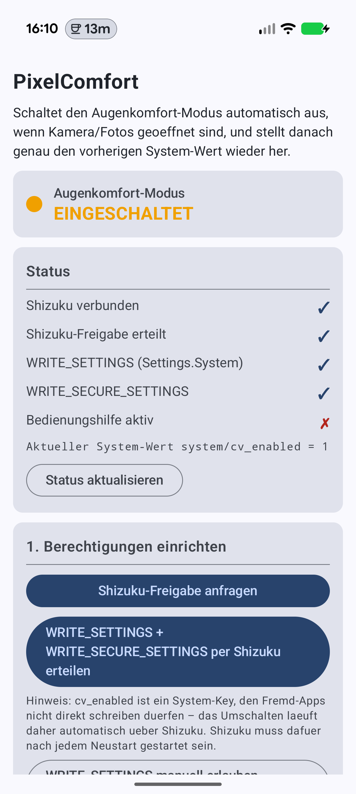
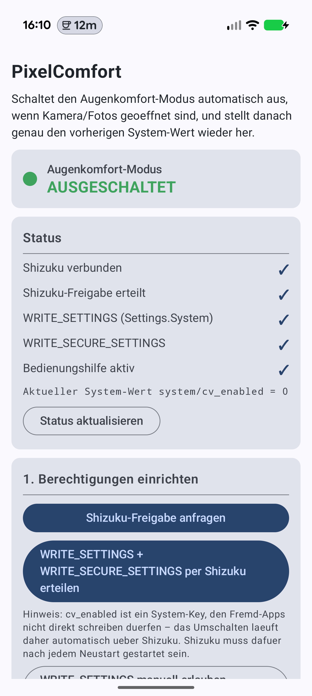

# 👁️ PixelComfort

**Schaltet den Augenkomfort-Modus (Comfort View) auf dem Google Pixel automatisch aus, sobald Kamera oder Google Fotos geöffnet werden – und stellt danach exakt den vorherigen Zustand wieder her.**

-3DDC84?logo=android&logoColor=white)


[](https://github.com/WEITERFUNKEN-Thomas/pixelcomfort/releases/latest)

---

## 🤔 Warum?

Der mit dem **Pixel Drop (März 2026)** eingeführte *Comfort-Filter* („Augenkomfort-Modus", Einstellungen → Display & Touch → Komfort-Filter) gibt dem Display eine wärmere, pastellige Optik – super für die Augen, aber **furchtbar beim Fotografieren**: Sucherbild und Fotos-Vorschau wirken farbstichig.

Google bietet dafür – anders als beim Nachtlicht – **keinen Zeitplan und keine öffentliche API**. PixelComfort löst das automatisch:

```
Kamera/Fotos öffnen  ──▶  Comfort View AUS
App verlassen        ──▶  vorheriger Zustand wiederhergestellt
```

Zum Umschalten von Hand gibt es zusätzlich eine **Schnelleinstellungs-Kachel**.

Dabei wird **immer der echte System-Zustand respektiert**: Der aktuelle Wert wird live gelesen und gemerkt – war der Filter vorher aus, bleibt er aus. Andere Einstellungen (Dynamisch, Intensität) werden nicht angetastet.

## 📱 Screenshots

| Comfort View an | Comfort View aus |
|:---:|:---:|
|  |  |

## ⚙️ Wie es funktioniert

Der Schalter liegt als nicht-öffentlicher Key in den System-Settings – **per adb-Diff auf einem Pixel 10 Pro ermittelt**, nicht geraten:

| Einstellung | Namespace | Key | Werte |
|---|---|---|---|
| Augenkomfort-Modus | `system` | `cv_enabled` | `1` = an, `0` = aus |
| Dynamisch (Adaptiv) | `system` | `cv_dynamic_enabled` | wird **nicht** angefasst |
| Intensität | `system` | `cv_preferred_intensity` | wird **nicht** angefasst |

Drei Bausteine:

1. **AccessibilityService** – lauscht auf `TYPE_WINDOW_STATE_CHANGED` und erkennt, wann eine Ziel-App (konfigurierbar, Default: Google Kamera + Google Fotos) in den Vordergrund kommt oder verschwindet.
2. **SettingWriter** – versucht zuerst den `ContentResolver`; da `cv_enabled` ein `@hide`-Key ist, den Fremd-Apps weder lesen noch schreiben dürfen (auch nicht mit `WRITE_SECURE_SETTINGS`!), greift automatisch der Fallback …
3. **Shizuku** – führt `settings get/put system cv_enabled …` mit ADB-Shell-Rechten aus. **Kein Root nötig.** Alle Shell-Aufrufe laufen auf einem seriellen Hintergrund-Thread.

## 🎛️ Schnelleinstellungs-Kachel

Die Kachel **„Augenkomfort"** schaltet den Filter von Hand um und zeigt den Live-Zustand
(hell = an, dunkel = aus). Hinzufügen entweder in der App unter *3. Schnelleinstellungs-Kachel*
(Android 13+) oder direkt in den Schnelleinstellungen über das Stift-Symbol.

Sie greift auf denselben Key zu wie die Automatik und läuft über dieselbe serielle
Warteschlange – beide können sich also nicht überholen. Schaltest du **während** eine
Ziel-App vorn ist von Hand um, gilt deine Entscheidung auch nach dem Verlassen der App:
der gemerkte Wert wird mitgezogen, statt später still überschrieben zu werden.

Ohne laufendes Shizuku ist die Kachel *nicht verfügbar* (ausgegraut) – ohne Shizuku
lässt sich `cv_enabled` weder lesen noch schreiben, ein klickbarer Schalter wäre dann
nur irreführend.

## 🚀 Einrichtung

Voraussetzungen: Pixel mit Android 17, [Shizuku](https://shizuku.rikka.app/) installiert und gestartet.

1. **App installieren**: [neuestes APK aus den Releases](https://github.com/WEITERFUNKEN-Thomas/pixelcomfort/releases/latest) laden (oder selbst bauen, siehe unten) und öffnen
2. **„Shizuku-Freigabe anfragen"** → im Shizuku-Dialog *Immer zulassen*
3. **„WRITE_SETTINGS + WRITE_SECURE_SETTINGS per Shizuku erteilen"** (einmalig)
4. **Bedienungshilfe aktivieren**: Einstellungen → Bedienungshilfen → *PixelComfort Auto-Aus* einschalten
5. Optional: **„Kachel zu den Schnelleinstellungen hinzufügen"** für das manuelle Umschalten
6. Fertig! Mit den Test-Buttons **Comfort AN / AUS** kannst du das Umschalten sofort prüfen – die Status-Karte oben zeigt live, ob der Filter gerade an ist.

> ⚠️ **Nach jedem Neustart** muss Shizuku wieder laufen (bei kabellosem Debugging startet es via „Bei Systemstart starten" automatisch).

## 🔨 Bauen

```bash
# Debug
./gradlew :app:assembleDebug

# Signiertes Release (benötigt keystore.properties + eigenen Keystore, siehe unten)
./gradlew :app:assembleRelease
```

Für Release-Builds eine `keystore.properties` im Projekt-Root anlegen (liegt in `.gitignore`):

```properties
storeFile=mein-release.jks
storePassword=…
keyAlias=…
keyPassword=…
```

Fehlt die Datei, wird das Release einfach unsigniert gebaut.

**Stack:** Kotlin 2.4.10 · Jetpack Compose (Material 3, BOM 2026.08.00) · Shizuku-API 13.1.5 · AGP 9.3.1 · Gradle 9.7.1 · targetSdk 37

## 🔍 Debugging

Die App loggt jede Aktion unter dem Tag `PixelComfort`:

```bash
adb logcat -s PixelComfort:*
# z.B.:
# Ziel-App 'com.google.android.GoogleCamera' -> system/cv_enabled AUS (gemerkt=1) via SHIZUKU, ok=true
```

Falls der Key auf deinem Gerät anders heißt – selbst finden per Diff:

```bash
adb shell settings list system > vorher.txt
#  … Comfort-Filter in den Einstellungen umschalten …
adb shell settings list system > nachher.txt
diff vorher.txt nachher.txt
```

Namespace, Key und Werte lassen sich in der App unter **„Erweitert"** anpassen; auch die Ziel-Packages sind frei konfigurierbar.

## ⚠️ Einschränkungen

- **Shizuku muss laufen** – ohne aktiven Shizuku-Dienst kann der Key nicht geschrieben werden (er ist für Fremd-Apps gesperrt, der ContentResolver-Weg scheitert systembedingt).
- **Advanced Protection Mode**: Android 17 deaktiviert damit Bedienungshilfen, die keine echten Barrierefreiheits-Tools sind. Die App erkennt und meldet das im Status.
- Wird die **Bedienungshilfe manuell deaktiviert, während** Kamera/Fotos offen sind, bleibt der Filter aus (Kachel, Test-Button „Comfort AN" oder Systemeinstellung nutzen).
- Im kompakten Kachel-Layout des Pixel zeigt Android **nur das Icon** – Label und Untertitel („An"/„Aus") erscheinen erst im Bearbeiten-Screen der Schnelleinstellungen.
- Getestet auf **Pixel 10 Pro mit Android 17** – der `cv_*`-Key existiert vermutlich nur auf Pixel-Geräten mit dem Comfort-Filter-Feature (`com.android.pixeldisplayservice`).

## 📄 Rechtliches

Privates Hobby-Projekt, ohne Gewähr. Kein offizielles Google-Produkt. „Pixel" ist eine Marke von Google LLC.
