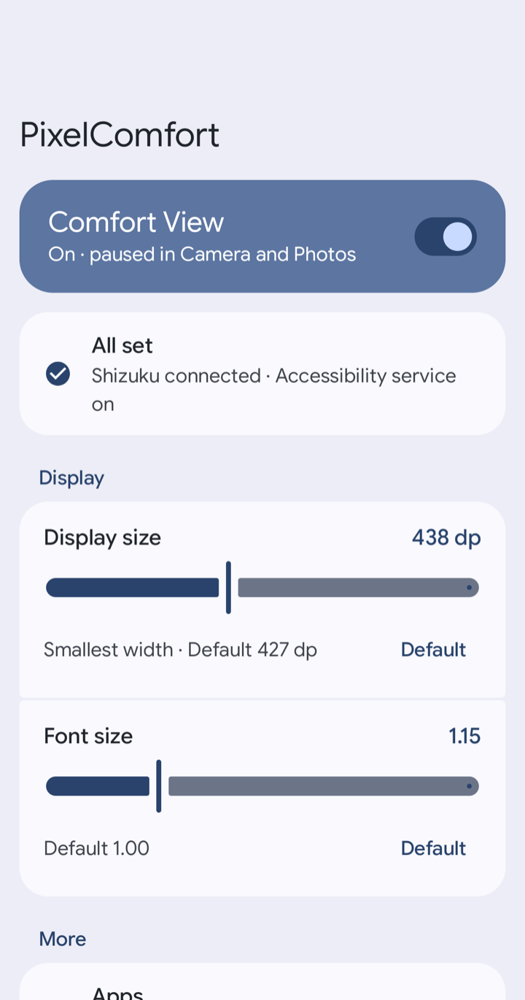
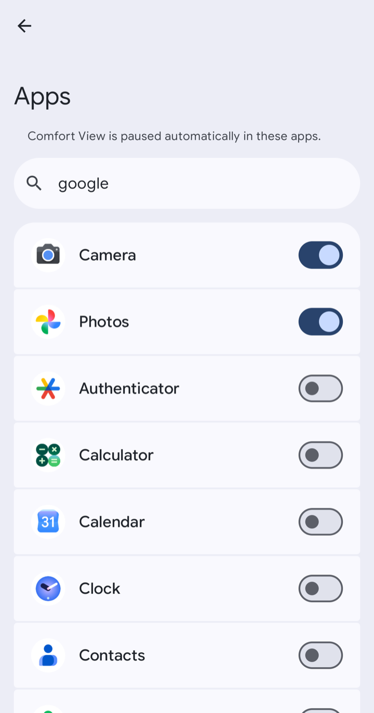
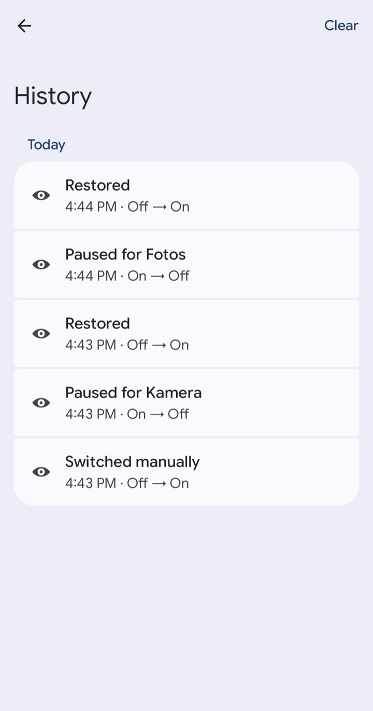

# 👁️ PixelComfort

**English** · [Deutsch](README.de.md)

**Turns Comfort View off automatically on Google Pixel as soon as you open the camera or Google Photos – and restores exactly the previous state when you leave.**

-3DDC84?logo=android&logoColor=white)


[](https://github.com/WEITERFUNKEN-Thomas/pixelcomfort/releases/latest)

---

## 🤔 Why?

The *comfort filter* introduced with the **Pixel Drop of March 2026** (“Comfort View”, Settings → Display & touch → Comfort filters) gives the display a warmer, pastel look. That is easy on the eyes but **terrible for taking photos**: the viewfinder and the Photos preview get a colour cast.

Unlike Night Light, Google offers **no schedule and no public API** for it. PixelComfort handles it automatically:

```
Open camera / Photos  ──▶  Comfort View OFF
Leave the app         ──▶  previous state restored
```

The **real system state is always respected**: the current value is read live and remembered – if the filter was off before, it stays off. Other settings (dynamic, intensity) are never touched.

## ✨ Features

- **Automation** – pauses Comfort View in the apps you pick and restores it afterwards
- **App picker** – choose the apps from a list with icons and search
- **Main switch and Quick Settings tile** – switch Comfort View by hand
- **Display** – sliders for display size (smallest width in dp) and font size, each with a *Default* button
- **Private DNS by Wi‑Fi** – private DNS off on your home Wi‑Fi (so e.g. AdGuard Home filters), on everywhere else
- **History** – shows when Comfort View was paused, restored or switched manually, and what went wrong
- **Shizuku warning** – a notification tells you when Shizuku isn’t running
- **Material You** – follows your system colours, light and dark
- **English and German** – follows the system language, selectable per app on Android 13+

## 📱 Screenshots

| Home | Apps | History |
|:---:|:---:|:---:|
|  |  |  |

## ⚙️ How it works

The switch is a non-public key in the system settings – **found with an adb diff on a Pixel 10 Pro**, not guessed:

| Setting | Namespace | Key | Values |
|---|---|---|---|
| Comfort View | `system` | `cv_enabled` | `1` = on, `0` = off |
| Dynamic (adaptive) | `system` | `cv_dynamic_enabled` | **not** touched |
| Intensity | `system` | `cv_preferred_intensity` | **not** touched |

Three building blocks:

1. **AccessibilityService** – listens for `TYPE_WINDOW_STATE_CHANGED` and detects when one of the selected apps comes to the foreground or leaves it.
2. **SettingWriter** – tries the `ContentResolver` first. Because `cv_enabled` is a `@hide` key that other apps may neither read nor write (not even with `WRITE_SECURE_SETTINGS`), it falls back automatically to …
3. **Shizuku** – runs `settings get/put system cv_enabled …` with ADB shell rights. **No root required.** All calls run on one serial background thread.

The automation is deliberately cautious:

- If the value **can’t be read** (Shizuku isn’t running), it does not pause at all – a guessed value would be “restored” wrongly later.
- If the filter **was already off**, nothing is written.
- If **restoring fails**, the value stays remembered and the next app switch tries again.

## 🌐 Private DNS by Wi‑Fi

If your home network has its own DNS filter (e.g. **AdGuard Home** or Pi-hole), a private DNS entered on the phone bypasses it at home. PixelComfort switches it for you:

```
Home Wi‑Fi       ──▶  private DNS off  (the DNS of your home network is used)
anywhere else    ──▶  private DNS on   (e.g. dns.adguard-dns.com)
```

| Setting | Namespace | Key | Values |
|---|---|---|---|
| Private DNS mode | `global` | `private_dns_mode` | `off` at home, `hostname` elsewhere |
| Private DNS name | `global` | `private_dns_specifier` | your DNS name |

- **Power-saving**: no polling, no timer. Android reports every change of the default network by itself (`registerDefaultNetworkCallback`), the app only reacts.
- **Home only counts if secured**: a Wi‑Fi from your list that is protected by a password (WPA2/WPA3/Enterprise). Open and OWE networks never count – anyone could open one with the same name.
- **When in doubt, private DNS stays on**: no network, unknown Wi‑Fi, Wi‑Fi name not readable (location off) – all count as away.
- **Nothing is left switched off**: turning the automation or the accessibility service off enters private DNS again right away.
- **No Shizuku needed for switching**: these keys are public; with `WRITE_SECURE_SETTINGS` (granted once via Shizuku) the app writes them directly.
- Changed the DNS name in the Android settings? The app picks it up the next time you get home.

Set it up under **More → Private DNS**: allow the location permission (*While using the app* is enough – Android only reveals the Wi‑Fi name with it, the location itself is never used), tap *Add current Wi‑Fi* at home, check the DNS name, turn on *Automation*. Needs Android 12 or newer.

> 💡 If your router hands out a second DNS server next to AdGuard Home (e.g. `9.9.9.9`), the phone can still bypass the filter at home now and then. Enter only AdGuard Home as DNS in the router.

Emergency reset over adb:

```bash
adb shell settings put global private_dns_mode hostname
adb shell settings put global private_dns_specifier dns.adguard-dns.com
```

## 🖥️ Display size and font size

Both sliders write when you let go. Display size uses `wm density` through Shizuku, font size uses the public key `system/font_scale`. The ranges are limited on purpose (320–600 dp, 0.85–2.00) so the device always stays usable.

Emergency reset over adb:

```bash
adb shell wm density reset
adb shell settings put system font_scale 1.0
```

## 🎛️ Quick Settings tile

The **“Comfort View”** tile switches the filter by hand and shows the live state. Add it in the app under *More → Add tile* (Android 13+) or in Quick Settings using the pencil.

The tile, the main switch and the automation share one queue, so they can’t overtake each other. If you switch by hand **while** a selected app is in front, your choice also holds after you leave the app.

Without Shizuku the tile is *unavailable* (greyed out).

## 🚀 Setup

Requirements: a Pixel with Android 17, [Shizuku](https://shizuku.rikka.app/) installed and started.

1. **Install the app**: get the [latest APK from the releases](https://github.com/WEITERFUNKEN-Thomas/pixelcomfort/releases/latest) (or build it yourself, see below) and open it
2. Under **Setup**, tap **Shizuku** → choose *Allow all the time* in the Shizuku dialog
3. Tap **Accessibility service** → turn on *PixelComfort auto-off*
4. Tap **Notifications** and allow them, so the app can warn you when Shizuku isn’t running
5. Optional: **More → Apps** to pick other apps, **More → Private DNS** for private DNS by Wi‑Fi, **More → Add tile** for the tile

Once everything is done, the setup group shrinks to a single line: *All set*.

> ⚠️ Shizuku has to run again **after every restart** (with wireless debugging it can start automatically).

## 🔨 Build

```bash
# Debug
./gradlew :app:assembleDebug

# Signed release (needs keystore.properties and your own keystore, see below)
./gradlew :app:assembleRelease

# Unit tests
./gradlew :app:testDebugUnitTest
```

For release builds create a `keystore.properties` in the project root (it is in `.gitignore`):

```properties
storeFile=my-release.jks
storePassword=…
keyAlias=…
keyPassword=…
```

If the file is missing, the release is simply built unsigned.

**Stack:** Kotlin 2.4.10 · Jetpack Compose (Material 3, BOM 2026.08.00) · Shizuku API 13.1.5 · AGP 9.3.1 · Gradle 9.7.1 · targetSdk 37

## 🔍 Debugging

The app logs every action under the tag `PixelComfort` (log lines are in German):

```bash
adb logcat -s 'PixelComfort:*'
# e.g.:
# Ziel-App 'com.google.android.GoogleCamera' -> system/cv_enabled AUS (gemerkt=1) ok=true via SHIZUKU: …
```

If the key has a different name on your device, find it yourself with a diff:

```bash
adb shell settings list system > before.txt
#  … toggle the comfort filter in Settings …
adb shell settings list system > after.txt
diff before.txt after.txt
```

Namespace, key and values can be changed in the app under **More → Advanced**.

## ⚠️ Limitations

- **Shizuku has to run** – without it the key can’t be written (it is locked for other apps).
- **Advanced Protection Mode**: Android 17 then disables accessibility services that aren’t real accessibility tools. The app detects this and says so under Setup.
- If you **turn the accessibility service off while** a selected app is open, the filter stays off. Use the main switch, the tile or the system setting.
- **Private DNS by Wi‑Fi** needs the location permission and location turned on – otherwise the Wi‑Fi name can’t be read and private DNS simply stays on at home too. It only switches while the accessibility service is on.
- **Not every dp value is reachable**: Android stores the density in whole dpi, so above roughly 450 dp the display size moves in steps of 1–2 dp.
- In the compact tile layout of the Pixel, Android shows **only the icon** – label and subtitle only appear in the edit screen of Quick Settings.
- Tested on a **Pixel 10 Pro with Android 17** – the `cv_*` key probably only exists on Pixel devices with the comfort filter feature (`com.android.pixeldisplayservice`).

## 📄 Legal

**Use at your own risk.** The app changes system settings via Shizuku and `WRITE_SECURE_SETTINGS`. Wrong values under *Advanced* or an extreme display size can make the device hard to use – `adb shell wm density reset` and `adb shell settings put system font_scale 1.0` undo the display changes.

Private hobby project, provided without warranty. Not an official Google product. “Pixel” is a trademark of Google LLC.

Licensed under the [MIT License](LICENSE).
